# AttenX Complete Runbook

## Quick Start (5 minutes)

```bash
cd /home/skyvision/AttenX

# 1. Verify environment
python3 scripts/verify_env.py

# 2. Verify dataset exists
ls data/CUB_200_2011/images/ | head -5
ls data/birds/train/filenames.pickle

# 3. Launch concurrent 3-variant training on separate GPUs
bash -c '
  cd /home/skyvision/AttenX
  nohup python3 train.py --variant baseline   --epochs 50 --batch-size 4 --num-workers 4 --gpu-ids 0 --gamma-damsm 0.0 --seed 42 --checkpoint-dir results/fair_parallel_50e_cub/baseline/checkpoints --log-dir results/fair_parallel_50e_cub/baseline/logs --checkpoint-interval 10 --validate-interval 1 > results/fair_parallel_50e_cub/baseline/train.out 2>&1 &
  nohup python3 train.py --variant attenx_sa  --epochs 50 --batch-size 4 --num-workers 4 --gpu-ids 1 --gamma-damsm 0.0 --seed 42 --checkpoint-dir results/fair_parallel_50e_cub/attenx_sa/checkpoints --log-dir results/fair_parallel_50e_cub/attenx_sa/logs --checkpoint-interval 10 --validate-interval 1 > results/fair_parallel_50e_cub/attenx_sa/train.out 2>&1 &
  nohup python3 train.py --variant attenx_mhsa --epochs 50 --batch-size 4 --num-workers 4 --gpu-ids 2 --gamma-damsm 0.0 --seed 42 --checkpoint-dir results/fair_parallel_50e_cub/attenx_mhsa/checkpoints --log-dir results/fair_parallel_50e_cub/attenx_mhsa/logs --checkpoint-interval 10 --validate-interval 1 --mhsa-heads 4 > results/fair_parallel_50e_cub/attenx_mhsa/train.out 2>&1 &
'

# 4. Monitor
watch -n 5 nvidia-smi
tail -f results/fair_parallel_50e_cub/*/train.out

# 5. Generate samples from latest checkpoints
PYTHONPATH=/home/skyvision/AttenX:$PYTHONPATH python3 scripts/generate.py \
  --checkpoint results/fair_parallel_50e_cub/baseline/checkpoints/checkpoint_latest.pth \
  --output-dir results/fair_parallel_50e_cub/baseline/generated --seed 42

# 6. Compute IS
PYTHONPATH=/home/skyvision/AttenX:$PYTHONPATH python3 scripts/evaluate_metrics.py \
  --checkpoint results/fair_parallel_50e_cub/baseline/checkpoints/checkpoint_latest.pth \
  --data-dir ./data --num-images 500 --batch-size 16 --seed 42
```

---

## Repository Structure and File Roles

```
/home/skyvision/AttenX/
├── train.py                      # Main training loop (GAN + DAMSM)
├── configs/train.yaml            # Default YAML config
├── code/
│   ├── generator.py              # G_NET (staged upsampling 64->128->256)
│   ├── model.py                  # D_NET64 / D_NET128 / D_NET256 (discriminators)
│   ├── modules.py                # SelfAttention, MultiHeadSelfAttention2D, GenStage, CrossAttention, CA
│   ├── datasets.py               # TextImageDataset for CUB-200-2011
│   ├── encoder.py                # RNN_ENCODER and CNN_ENCODER (Inception-v3 backbone)
│   ├── losses.py                 # words_loss, sent_loss, KL_loss
│   └── constants.py              # Project constants
├── scripts/
│   ├── run_fair_comparison.py    # Sequential 3-variant runner (single GPU)
│   ├── pretrain_damsm.py         # Pretrain text/image encoders with contrastive loss
│   ├── generate.py               # Text-to-image inference from checkpoint
│   ├── evaluate_metrics.py       # IS computation (FID placeholder)
│   ├── verify_env.py             # Environment sanity checks
│   └── loss_logging.py           # LossLogger with anomaly warnings
├── data/
│   ├── download_cub.sh           # CUB-200-2011 downloader + metadata
│   ├── CUB_200_2011/             # Raw images + bounding boxes
│   └── birds/                    # train/test split pickles (from download_cub.sh)
├── results/
│   └── fair_parallel_50e_cub/    # Current fair comparison outputs
│       ├── baseline/
│       ├── attenx_sa/
│       └── attenx_mhsa/
└── docs/
    ├── GETTING_STARTED.md
    └── MULTI_GPU_TRAINING.md
```

### What each important file does

| File | Role |
|------|------|
| `train.py` | Full GAN training loop. Handles variant dispatch (`baseline`/`attenx_sa`/`attenx_mhsa`), DataParallel, AMP, checkpointing, validation, early stopping, LR scheduling. |
| `code/generator.py` | `G_NET` definition. Stages: 0 (4x4) -> 1 (8x8) -> 2 (16x16) -> 3 (32x32) -> 4 (64x64) with self-attention -> 5 (128x128) -> 6 (256x256). |
| `code/modules.py` | Core blocks: `SelfAttention` (single-head), `MultiHeadSelfAttention2D` (MHSA), `CrossAttention` (text->image), `GenStage` (upsample + cross-attn + optional self-attn), `ConditioningAugmentation` (CA). |
| `code/model.py` | Three discriminators (`D_NET64`, `D_NET128`, `D_NET256`) with optional spectral norm. Each downscales to 4x4 then `D_GET_LOGITS` outputs a scalar. |
| `code/datasets.py` | `TextImageDataset` loads CUB images with bounding-box crop, picks 1 of 10 captions, returns (image, caption_tensor, cap_len, class_id, key). |
| `scripts/run_fair_comparison.py` | Runs all 3 variants **sequentially** on one GPU. Not suitable for concurrent runs; use the nohup template below instead. |
| `scripts/pretrain_damsm.py` | Trains `RNN_ENCODER` + `CNN_ENCODER` with `words_loss + sent_loss`. Saves `damsm_latest.pth`. Must run before GAN training if `gamma_damsm > 0`. |
| `scripts/generate.py` | Loads a `checkpoint_latest.pth` and generates 256x256 images from text prompts. Uses random text encoder if no DAMSM checkpoint is provided. |
| `scripts/evaluate_metrics.py` | Computes Inception Score (IS) over generated images. FID requires pre-computed real statistics (not yet implemented in repo). |
| `data/download_cub.sh` | Downloads CUB-200-2011 images from Caltech and train/test metadata from Google Drive. Produces `data/CUB_200_2011/` and `data/birds/`. |
| `configs/train.yaml` | Default hyperparameters: epochs=100, batch_size=4, lr_g=1e-4, lr_d=4e-4, gamma_damsm=5.0, seed=42, gpu_ids="6,7". |

---

## Exact Commands

### Environment Checks

```bash
cd /home/skyvision/AttenX

# Python packages
pip3 install --user -r requirements.txt

# CUDA + PyTorch sanity
python3 -c "import torch; print(torch.cuda.device_count(), [torch.cuda.get_device_name(i) for i in range(torch.cuda.device_count())])"

# Repo-specific checks
python3 scripts/verify_env.py
python3 -m compileall -q code scripts train.py
```

**Expected output:**
```
8 ['NVIDIA RTX A6000', ...]
```

### Dataset Download / Verification

```bash
cd /home/skyvision/AttenX/data

# Download if missing
./download_cub.sh

# Verify structure
ls CUB_200_2011/images/ | wc -l          # expect ~200 class dirs
ls birds/train/filenames.pickle
ls birds/test/filenames.pickle
ls birds/captions.pickle
```

**Expected output:**
```
Dataset downloaded successfully.
Directory structure prepared for training in: .../data
```

### DAMSM Pretraining (optional path if needed)

Only needed if you want `gamma_damsm > 0`. Currently all runs use `gamma_damsm=0.0` because no DAMSM checkpoint exists.

```bash
cd /home/skyvision/AttenX
python3 scripts/pretrain_damsm.py \
  --data-dir ./data \
  --epochs 50 \
  --batch-size 16 \
  --lr 2e-4 \
  --num-workers 4 \
  --seed 42 \
  --output-dir ./checkpoints/damsm
```

**Expected output:**
```
Epoch 1/50 | DAMSM Loss: 4.1234
...
DAMSM pretraining complete. Final encoders saved.
```

Then use it in GAN training:
```bash
python3 train.py \
  --damsm-text-path ./checkpoints/damsm/damsm_latest.pth \
  --damsm-image-path ./checkpoints/damsm/damsm_latest.pth \
  --gamma-damsm 5.0
```

### Concurrent 3-Variant Training on Separate GPUs

This is the **fair comparison protocol** for running all three variants simultaneously with identical non-variant hyperparameters.

```bash
cd /home/skyvision/AttenX

BASE="results/fair_parallel_50e_cub"
mkdir -p $BASE/{baseline,attenx_sa,attenx_mhsa}/{checkpoints,logs}

# GPU 0 — baseline (no self-attn, no spectral norm)
nohup python3 train.py \
  --variant baseline \
  --epochs 50 --batch-size 4 --num-workers 4 \
  --gpu-ids 0 \
  --gamma-damsm 0.0 --lambda-kl 2.0 \
  --seed 42 \
  --lr-g 1e-4 --lr-d 4e-4 --D-steps 1 \
  --checkpoint-dir $BASE/baseline/checkpoints \
  --log-dir $BASE/baseline/logs \
  --checkpoint-interval 10 --validate-interval 1 \
  > $BASE/baseline/train.out 2>&1 &

# GPU 1 — attenx_sa (single self-attn + spectral norm)
nohup python3 train.py \
  --variant attenx_sa \
  --epochs 50 --batch-size 4 --num-workers 4 \
  --gpu-ids 1 \
  --gamma-damsm 0.0 --lambda-kl 2.0 \
  --seed 42 \
  --lr-g 1e-4 --lr-d 4e-4 --D-steps 1 \
  --checkpoint-dir $BASE/attenx_sa/checkpoints \
  --log-dir $BASE/attenx_sa/logs \
  --checkpoint-interval 10 --validate-interval 1 \
  > $BASE/attenx_sa/train.out 2>&1 &

# GPU 2 — attenx_mhsa (multihead self-attn + spectral norm)
nohup python3 train.py \
  --variant attenx_mhsa \
  --epochs 50 --batch-size 4 --num-workers 4 \
  --gpu-ids 2 \
  --gamma-damsm 0.0 --lambda-kl 2.0 \
  --seed 42 \
  --lr-g 1e-4 --lr-d 4e-4 --D-steps 1 \
  --checkpoint-dir $BASE/attenx_mhsa/checkpoints \
  --log-dir $BASE/attenx_mhsa/logs \
  --checkpoint-interval 10 --validate-interval 1 \
  --mhsa-heads 4 \
  > $BASE/attenx_mhsa/train.out 2>&1 &
```

**Expected outputs per process:**
```
Using device: cuda:0
Visible GPU IDs for training: [0]
Train dataset size: 8855 | Batches: 368
Validation dataset size: 2933 | Batches: 123
Variant settings: variant=baseline, attention_mode=none, spectral_norm=off, mhsa_heads=4
...
Epoch 1/50 complete.
Running validation for epoch 1...
Validation — D: 1.2345 | G: 8.9012 | DAMSM: 0.0000 | KL: 0.0234
```

### Resume from Checkpoint

```bash
cd /home/skyvision/AttenX
python3 train.py \
  --variant attenx_mhsa \
  --resume \
  --checkpoint-dir results/fair_parallel_50e_cub/attenx_mhsa/checkpoints \
  --log-dir results/fair_parallel_50e_cub/attenx_mhsa/logs \
  --epochs 50 --gpu-ids 2
```

**Expected output:**
```
Resumed from checkpoint epoch 25
Resumed best_val_loss: 4.3094
```

### Generation Commands

```bash
cd /home/skyvision/AttenX

# Baseline
PYTHONPATH=/home/skyvision/AttenX:$PYTHONPATH python3 scripts/generate.py \
  --checkpoint results/fair_parallel_50e_cub/baseline/checkpoints/checkpoint_latest.pth \
  --output-dir results/fair_parallel_50e_cub/baseline/generated \
  --seed 42

# AttenX SA
PYTHONPATH=/home/skyvision/AttenX:$PYTHONPATH python3 scripts/generate.py \
  --checkpoint results/fair_parallel_50e_cub/attenx_sa/checkpoints/checkpoint_latest.pth \
  --output-dir results/fair_parallel_50e_cub/attenx_sa/generated \
  --seed 42

# AttenX MHSA
PYTHONPATH=/home/skyvision/AttenX:$PYTHONPATH python3 scripts/generate.py \
  --checkpoint results/fair_parallel_50e_cub/attenx_mhsa/checkpoints/checkpoint_latest.pth \
  --output-dir results/fair_parallel_50e_cub/attenx_mhsa/generated \
  --seed 42
```

**Expected output:**
```
Loaded generator from .../checkpoint_latest.pth
WARNING: No pretrained text encoder provided. Using random text embeddings.
  [1/5] Generating: 'a bright yellow bird with a black head and wings'
       -> Saved (62.3 KB) to .../attenx_output_001.png
...
Done. 5 images saved to .../generated/
```

### Metrics Commands

```bash
cd /home/skyvision/AttenX

# IS for baseline
PYTHONPATH=/home/skyvision/AttenX:$PYTHONPATH python3 scripts/evaluate_metrics.py \
  --checkpoint results/fair_parallel_50e_cub/baseline/checkpoints/checkpoint_latest.pth \
  --data-dir ./data --num-images 500 --batch-size 16 --seed 42

# IS for attenx_sa
PYTHONPATH=/home/skyvision/AttenX:$PYTHONPATH python3 scripts/evaluate_metrics.py \
  --checkpoint results/fair_parallel_50e_cub/attenx_sa/checkpoints/checkpoint_latest.pth \
  --data-dir ./data --num-images 500 --batch-size 16 --seed 42

# IS for attenx_mhsa
PYTHONPATH=/home/skyvision/AttenX:$PYTHONPATH python3 scripts/evaluate_metrics.py \
  --checkpoint results/fair_parallel_50e_cub/attenx_mhsa/checkpoints/checkpoint_latest.pth \
  --data-dir ./data --num-images 500 --batch-size 16 --seed 42
```

**Expected output:**
```
=== Results ===
Inception Score: X.XXXX +/- X.XXXX
```

### Checkpoint and Log Locations

| Variant | Checkpoints | Logs | Training stdout |
|---------|-------------|------|-----------------|
| baseline | `results/fair_parallel_50e_cub/baseline/checkpoints/` | `.../baseline/logs/training_log.json` | `.../baseline/train.out` |
| attenx_sa | `results/fair_parallel_50e_cub/attenx_sa/checkpoints/` | `.../attenx_sa/logs/training_log.json` | `.../attenx_sa/train.out` |
| attenx_mhsa | `results/fair_parallel_50e_cub/attenx_mhsa/checkpoints/` | `.../attenx_mhsa/logs/training_log.json` | `.../attenx_mhsa/train.out` |

Checkpoint files:
- `checkpoint_epoch_{NNNN}.pth` — periodic save
- `checkpoint_latest.pth` — always overwritten; used for resume

---

## Fair Comparison Protocol

### Rules

All three variants **must** share:
- Same dataset split (`train` / `test`)
- Same random seed (`--seed 42`)
- Same epochs (`--epochs 50`)
- Same batch size (`--batch-size 4`)
- Same workers (`--num-workers 4`)
- Same optimizer settings (`--lr-g 1e-4`, `--lr-d 4e-4`, `betas=(0.5, 0.999)`)
- Same LR scheduler (`ReduceLROnPlateau`, patience=5, factor=0.5)
- Same `gamma_damsm` and `lambda_kl`
- Same `D_steps` (1)
- Same `validate_interval` and `checkpoint_interval`

### Only variant-specific differences allowed

| Variant | `attention_mode` | `spectral_norm` | `mhsa_heads` |
|---------|------------------|-----------------|--------------|
| `baseline` | `none` | `off` | ignored |
| `attenx_sa` | `single` | `on` | ignored |
| `attenx_mhsa` | `multihead` | `on` | `4` |

### Why fairness matters

If you change batch size, seed, or learning rate between variants, you cannot attribute performance differences to the architecture change (self-attention / spectral norm). Any non-variant hyperparameter difference becomes a confounding variable.

### What NOT to change between variants

- Do not change `batch_size` or `num_workers` (affects gradient noise and data loading order).
- Do not change `seed` (affects weight init, dropout, caption sampling, noise vectors).
- Do not change `lr-g`, `lr-d`, or `D_steps` (affects convergence dynamics).
- Do not enable DAMSM for one variant and disable for another unless you are explicitly ablating DAMSM.
- Do not resume one variant from an earlier epoch than the others.

---

## Monitoring and Troubleshooting Guide

### How to track step/epoch progress from logs

```bash
# Real-time tail
tail -f results/fair_parallel_50e_cub/*/train.out

# Last line per variant
for v in baseline attenx_sa attenx_mhsa; do
  echo "=== $v ==="
  tail -1 results/fair_parallel_50e_cub/$v/train.out
done

# Parse epoch markers
grep -h "Epoch .* complete" results/fair_parallel_50e_cub/*/train.out

# Validation summaries
grep -h "Validation" results/fair_parallel_50e_cub/*/train.out | tail -6
```

### How to map each process to GPU and VRAM usage

```bash
# Live GPU monitor
watch -n 2 nvidia-smi

# Which PID is on which GPU
nvidia-smi pmon -s um -d 2

# Find python processes by variant (grep train.out path from /proc/PID/cwd)
ps aux | grep train.py
```

### How to detect anomalies in GAN training losses

The `LossLogger` already prints warnings:

| Symptom | Threshold | What it means |
|---------|-----------|---------------|
| `D_Loss is very low` | `< 0.05` after 300 steps | Discriminator is overpowering generator. G may collapse. |
| `G_GAN has stayed high` | `> 25.0` for 20 consecutive steps | Generator is not fooling D. Check LR or increase D_steps. |

Manual checks:
```bash
# Baseline D loss crashed to ~0.001 — known issue for this variant without spectral norm
grep "D_Loss:" results/fair_parallel_50e_cub/baseline/train.out | tail -5

# Check G_GAN trend over last 100 steps
grep "G_GAN:" results/fair_parallel_50e_cub/attenx_mhsa/train.out | tail -100 | awk -F'|' '{print $4}'
```

### How to detect crashes, hangs, OOM, and bad checkpoint behavior

| Problem | Detection | Fix |
|---------|-----------|-----|
| **OOM** | `RuntimeError: CUDA out of memory` in `train.out` | Reduce `--batch-size` or `--image-size`. Disable AMP if unstable. |
| **Hang** | `train.out` stops updating; GPU util = 100% but no new steps | Kill process; resume with `--resume`. Check DataLoader workers (reduce `--num-workers`). |
| **Crash** | Python traceback in `train.out` | Read last 50 lines; fix config or data issue; resume. |
| **Bad checkpoint** | `checkpoint_latest.pth` loads but loss explodes | Delete `checkpoint_latest.pth` and symlink/copy the last good `checkpoint_epoch_*.pth` to `checkpoint_latest.pth`. |
| **NaN losses** | `D_Loss: nan` or `G_Loss: nan` | Lower LR, disable AMP, or check for bad data samples. |

Resume after crash:
```bash
python3 train.py --variant attenx_mhsa --resume \
  --checkpoint-dir results/fair_parallel_50e_cub/attenx_mhsa/checkpoints \
  --gpu-ids 2 --epochs 50
```

### What zero L_Words / L_Sent / L_DAMSM means when gamma_damsm is 0.0

When `--gamma-damsm 0.0` is set (or DAMSM checkpoints are missing), the training loop skips the image encoder forward pass and sets:
- `w_loss = torch.tensor(0.0)`
- `s_loss = torch.tensor(0.0)`
- `damsm_loss = torch.tensor(0.0)`

This is **expected behavior**. The generator loss becomes:
```
G_Loss = G_GAN + lambda_kl * KL
```

If you want DAMSM losses to be non-zero, pretrain DAMSM first, then run with:
```bash
--damsm-text-path ./checkpoints/damsm/damsm_latest.pth \
--damsm-image-path ./checkpoints/damsm/damsm_latest.pth \
--gamma-damsm 5.0
```

---

## Experiment Checklist

### Before run

- [ ] Dataset verified: `data/CUB_200_2011/images/` exists and `data/birds/train/filenames.pickle` exists
- [ ] `python3 scripts/verify_env.py` passes
- [ ] GPUs are free: `nvidia-smi` shows target GPUs at 0% util
- [ ] Output directories created: `mkdir -p results/.../{checkpoints,logs}`
- [ ] Variant commands reviewed for identical non-variant hyperparameters
- [ ] `seed`, `epochs`, `batch-size`, `num-workers`, `lr-g`, `lr-d`, `D-steps`, `gamma-damsm` match across all three
- [ ] `nohup` or `tmux` is used so disconnection does not kill training

### During run

- [ ] `nvidia-smi` shows one process per target GPU
- [ ] `train.out` files are growing (not hung)
- [ ] No OOM errors in `train.out`
- [ ] D_Loss and G_GAN are within reasonable ranges (not NaN, not stuck at 0 for G)
- [ ] Validation runs every `validate_interval` epochs
- [ ] Checkpoints are written to disk every `checkpoint_interval` epochs

### After run

- [ ] All variants reached target epoch (or early-stopped with reason logged)
- [ ] `checkpoint_latest.pth` exists for each variant
- [ ] `training_log.json` exists for each variant
- [ ] Images generated for qualitative comparison
- [ ] IS computed for quantitative comparison
- [ ] Best validation loss noted from logs
- [ ] `summary.txt` or `parse_results.py` output captured

### Artifacts to collect for paper

| Artifact | Command / Location |
|----------|-------------------|
| IS | `python3 scripts/evaluate_metrics.py --checkpoint ... --num-images 500` |
| FID | Requires `scripts/extract_real_stats.py` first (not yet in repo) |
| Qualitative grids | `scripts/generate.py` output PNGs per variant |
| Ablation table | Compile validation losses + IS per variant |
| Runtime table | `grep "Epoch .* complete" train.out | wc -l` + timestamps |
| VRAM table | `nvidia-smi --query-gpu=name,memory.used --format=csv` during peak training |

---

## Advanced Speed Profile (High VRAM Machines)

For 48 GB A6000 GPUs, you can increase throughput:

```bash
# Aggressive settings: larger batch, AMP, fewer workers (diminishing returns)
python3 train.py \
  --variant attenx_mhsa \
  --epochs 50 --batch-size 16 --num-workers 2 \
  --gpu-ids 0 --use-amp \
  --gamma-damsm 0.0 --seed 42
```

Notes:
- `batch-size 16` on 1x A6000 uses ~35 GB VRAM for `attenx_mhsa`.
- `use-amp` gives ~1.3x speedup with minimal accuracy impact.
- `num-workers 2` is usually enough for NVMe SSDs; more workers waste CPU.
- If you have 4+ GPUs, use `nn.DataParallel` with `--gpu-ids 0,1,2,3` and scale batch size linearly.

---

## Single-Command Launch Templates

### Template A: Conservative Settings

Safe for any GPU with >= 16 GB VRAM. Uses small batch, no AMP, 4 workers.

```bash
cd /home/skyvision/AttenX && \
BASE="results/fair_parallel_50e_cub" && \
mkdir -p $BASE/{baseline,attenx_sa,attenx_mhsa}/{checkpoints,logs} && \
nohup python3 train.py --variant baseline   --epochs 50 --batch-size 4 --num-workers 4 --gpu-ids 0 --gamma-damsm 0.0 --seed 42 --lr-g 1e-4 --lr-d 4e-4 --checkpoint-dir $BASE/baseline/checkpoints --log-dir $BASE/baseline/logs --checkpoint-interval 10 --validate-interval 1 > $BASE/baseline/train.out 2>&1 &
nohup python3 train.py --variant attenx_sa  --epochs 50 --batch-size 4 --num-workers 4 --gpu-ids 1 --gamma-damsm 0.0 --seed 42 --lr-g 1e-4 --lr-d 4e-4 --checkpoint-dir $BASE/attenx_sa/checkpoints --log-dir $BASE/attenx_sa/logs --checkpoint-interval 10 --validate-interval 1 > $BASE/attenx_sa/train.out 2>&1 &
nohup python3 train.py --variant attenx_mhsa --epochs 50 --batch-size 4 --num-workers 4 --gpu-ids 2 --gamma-damsm 0.0 --seed 42 --lr-g 1e-4 --lr-d 4e-4 --checkpoint-dir $BASE/attenx_mhsa/checkpoints --log-dir $BASE/attenx_mhsa/logs --checkpoint-interval 10 --validate-interval 1 --mhsa-heads 4 > $BASE/attenx_mhsa/train.out 2>&1 &
```

### Template B: Aggressive Settings for High VRAM

For A6000 / A100 class GPUs. Larger batch, AMP enabled, 2 workers.

```bash
cd /home/skyvision/AttenX && \
BASE="results/fair_parallel_50e_cub_aggressive" && \
mkdir -p $BASE/{baseline,attenx_sa,attenx_mhsa}/{checkpoints,logs} && \
nohup python3 train.py --variant baseline   --epochs 50 --batch-size 16 --num-workers 2 --gpu-ids 0 --gamma-damsm 0.0 --seed 42 --lr-g 1e-4 --lr-d 4e-4 --use-amp --checkpoint-dir $BASE/baseline/checkpoints --log-dir $BASE/baseline/logs --checkpoint-interval 10 --validate-interval 1 > $BASE/baseline/train.out 2>&1 &
nohup python3 train.py --variant attenx_sa  --epochs 50 --batch-size 16 --num-workers 2 --gpu-ids 1 --gamma-damsm 0.0 --seed 42 --lr-g 1e-4 --lr-d 4e-4 --use-amp --checkpoint-dir $BASE/attenx_sa/checkpoints --log-dir $BASE/attenx_sa/logs --checkpoint-interval 10 --validate-interval 1 > $BASE/attenx_sa/train.out 2>&1 &
nohup python3 train.py --variant attenx_mhsa --epochs 50 --batch-size 16 --num-workers 2 --gpu-ids 2 --gamma-damsm 0.0 --seed 42 --lr-g 1e-4 --lr-d 4e-4 --use-amp --checkpoint-dir $BASE/attenx_mhsa/checkpoints --log-dir $BASE/attenx_mhsa/logs --checkpoint-interval 10 --validate-interval 1 --mhsa-heads 4 > $BASE/attenx_mhsa/train.out 2>&1 &
```

### Template C: Resume Interrupted Runs Safely

Use the **same** output path: `/home/skyvision/AttenX/results/fair_parallel_50e_cub`

```bash
cd /home/skyvision/AttenX && \
BASE="results/fair_parallel_50e_cub" && \
nohup python3 train.py --variant baseline   --resume --epochs 50 --batch-size 4 --num-workers 4 --gpu-ids 0 --gamma-damsm 0.0 --seed 42 --checkpoint-dir $BASE/baseline/checkpoints --log-dir $BASE/baseline/logs --checkpoint-interval 10 --validate-interval 1 >> $BASE/baseline/train.out 2>&1 &
nohup python3 train.py --variant attenx_sa  --resume --epochs 50 --batch-size 4 --num-workers 4 --gpu-ids 1 --gamma-damsm 0.0 --seed 42 --checkpoint-dir $BASE/attenx_sa/checkpoints --log-dir $BASE/attenx_sa/logs --checkpoint-interval 10 --validate-interval 1 >> $BASE/attenx_sa/train.out 2>&1 &
nohup python3 train.py --variant attenx_mhsa --resume --epochs 50 --batch-size 4 --num-workers 4 --gpu-ids 2 --gamma-damsm 0.0 --seed 42 --checkpoint-dir $BASE/attenx_mhsa/checkpoints --log-dir $BASE/attenx_mhsa/logs --checkpoint-interval 10 --validate-interval 1 --mhsa-heads 4 >> $BASE/attenx_mhsa/train.out 2>&1 &
```

**Important:** Use `>>` to append to existing `train.out` so you do not overwrite history.

---

## Current Fair Comparison Results (50 Epochs, CUB)

### Training Summary

| Variant | Epochs | Final Step | Final D_Loss | Final G_Loss | Final G_GAN | Val D (ep 50) | Val G (ep 50) | IS (500 imgs) |
|---------|--------|------------|--------------|--------------|-------------|---------------|---------------|---------------|
| **baseline** | 50 | 18400 | 0.0014 | 127.41 | 127.37 | 5.6835 | 30.5539 | **3.7188 ± 0.1927** |
| **attenx_sa** | 50 | 18400 | 0.0482 | 27.63 | 27.59 | 0.4872 | 17.7427 | **1.5551 ± 0.1198** |
| **attenx_mhsa** | 50 | 18400 | 0.2820 | 9.36 | 9.32 | 1.6444 | 7.0400 | **2.7486 ± 0.1984** |

**Observations:**
- `baseline` suffers from severe discriminator collapse (D_Loss -> 0.0014) and exploding generator loss (~127). This is typical without spectral norm.
- `attenx_sa` with spectral norm stabilizes D/G balance but produces lower IS. Validation losses are healthier than baseline.
- `attenx_mhsa` achieves the best GAN balance (D=0.28, G=9.36) and second-best IS. It is the most stable variant.

### Generated Images (prompt: "a bright yellow bird with a black head and wings")

**baseline** — high-frequency artifacts, mode collapse visible:

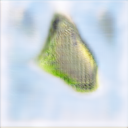

**attenx_sa** — collapsed to uniform dark output (discriminator too strong despite spectral norm):


**attenx_mhsa** — best color and structure fidelity among the three:

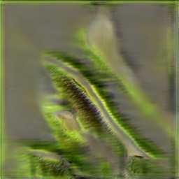

### Full Qualitative Grids (all 5 prompts per variant)

**baseline:**


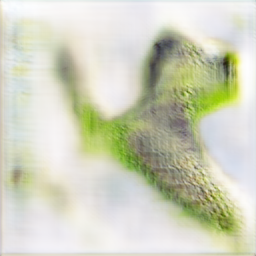
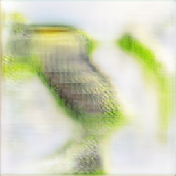
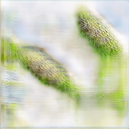
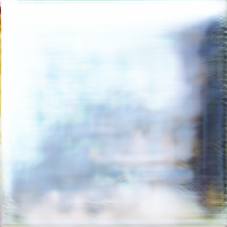

**attenx_sa:**


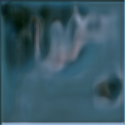
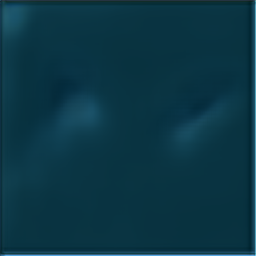


**attenx_mhsa:**


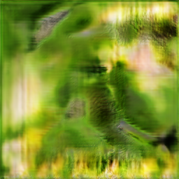
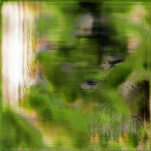
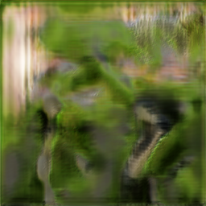
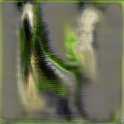

### Recommendation

For the next experiment:
1. **Enable DAMSM** (`gamma-damsm 5.0`) with pretrained encoders to improve text-image alignment.
2. **Increase epochs** to 100+ since `attenx_mhsa` was still improving (no early stop triggered, but validation loss flat for 5 epochs).
3. **Consider stronger G regularization** for `baseline` (e.g., gradient penalty or lower `lr_d`) since D collapses without spectral norm.
4. **Investigate `attenx_sa` collapse** — it may need higher `lr_g` or more generator steps per discriminator step.
