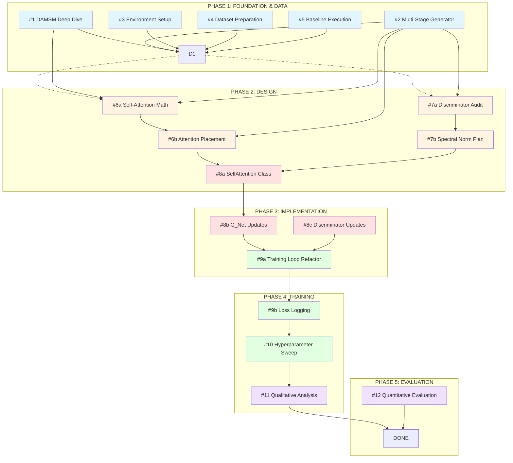

# AttenX Issue Dependency Graph

## Visual Dependency Flow



## Detailed Dependency Matrix

| Issue | Depends On | Blocks | Can Parallel With |
|-------|-----------|--------|-------------------|
| **#1** DAMSM Deep Dive | None | #6a, #9a | #2, #3, #4, #5 |
| **#2** Multi-Stage Generator | None | #6a, #6b, #7a | #1, #3, #4, #5 |
| **#3** Environment Setup | None | #4, #5, #7b | #1, #2, #4, #5 |
| **#4** Dataset Preparation | #3 | #5 | #1, #2 |
| **#5** Baseline Execution | #3, #4 | #6a, #6b | #1, #2 |
| | | | |
| **#6a** Self-Attention Math | #1, #2, #5 | #6b, #8a | #7a |
| **#6b** Attention Placement | #6a, #2 | #8a, #8b | #7a, #7b |
| **#7a** Discriminator Audit | #2 | #7b, #8c | #6a, #6b |
| **#7b** Spectral Norm Plan | #7a | #8c | #6b |
| | | | |
| **#8a** SelfAttention Class | #6a, #6b | #8b | #7b, #8c |
| **#8b** G_Net Updates | #8a, #6b | #9a | #8c |
| **#8c** Discriminator Updates | #7a, #7b | #9a | #8b |
| | | | |
| **#9a** Training Loop Refactor | #8b, #8c | #9b | None |
| **#9b** Loss Logging | #9a | #10 | None |
| **#10** Hyperparameter Sweep | #9b | #11, #12 | None |
| | | | |
| **#11** Qualitative Analysis | #10 | None | #12 |
| **#12** Quantitative Evaluation | #10 | None | #11 |

## Critical Path Analysis

```
The CRITICAL PATH (longest dependency chain) is:

#3 → #4 → #5 → #6a → #6b → #8a → #8b → #9a → #9b → #10 → #11/#12

This path has 11 sequential steps.

OPTIMIZATION OPPORTUNITIES:
- #8b and #8c can run in parallel (saves 1 step)
- #11 and #12 can run in parallel (saves 1 step)
- #6a/#6b and #7a/#7b can run in parallel (saves 2 steps)

OPTIMIZED CRITICAL PATH:
#3 → #4 → #5 → {#6a/#6b + #7a/#7b} → #8a → {#8b + #8c} → #9a → #9b → #10 → {#11 + #12}

This reduces the critical path to 9 sequential phases.
```

## Parallel Execution Opportunities

### After Phase 1 Complete:
```
Team Member A: #6a → #6b
Team Member B: #7a → #7b
```

### After #8a Complete:
```
Team Member A: #8b (Generator updates)
Team Member B: #8c (Discriminator updates)
```

### After Phase 4 Complete:
```
Team Member A: #11 (Qualitative Analysis)
Team Member B: #12 (Quantitative Evaluation)
```

## Milestone Checkpoints

```
M1: FOUNDATION COMPLETE
    When: #1, #2, #3, #4, #5 all closed
    Deliverable: Working environment + baseline results

M2: DESIGN COMPLETE
    When: #6a, #6b, #7a, #7b all closed
    Deliverable: Design documents + technical specs

M3: IMPLEMENTATION COMPLETE
    When: #8a, #8b, #8c all closed
    Deliverable: Enhanced-AttnGAN with self-attention and spectral norm

M4: TRAINING COMPLETE
    When: #9a, #9b, #10 all closed
    Deliverable: Trained model with loss curves

M5: EVALUATION COMPLETE
    When: #11, #12 all closed
    Deliverable: Paper-ready figures and metrics tables
```

## Risk Mitigation

| Risk | Mitigation Strategy |
|------|---------------------|
| #6a mathematical formulation takes longer | Start #7a in parallel while waiting |
| #8a module implementation has bugs | Unit tests in acceptance criteria catch issues early |
| Training instability in #10 | #9b logging provides early warning signs |
| Dataset issues in #4 | #5 baseline can use smaller subset temporarily |
| Spectral norm doesn't improve stability | #7b includes short trials to validate before full commit |
